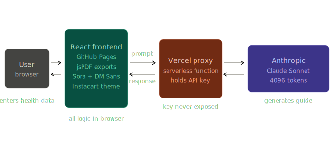
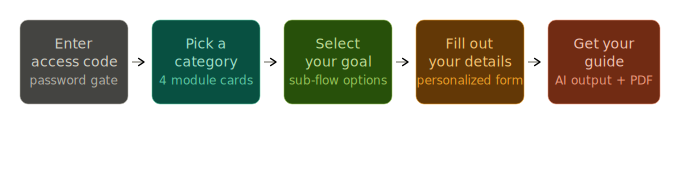

# HealthHelper 

An AI-powered personal health tool that generates personalized diet plans, workout routines, supplement recommendations, and evidence-backed health guidance — all through simple form inputs.

**Live Demo:** [hebronabel1.github.io/healthhelper](https://hebronabel1.github.io/healthhelper)  

---

## Architecture

HealthHelper is a client-side React app hosted on GitHub Pages. All AI calls are routed through a shared Vercel serverless proxy that keeps the Anthropic API key off the client. The frontend handles all logic, rendering, and PDF generation locally in the browser.

---

## User Journey

Every interaction follows the same 5-step flow regardless of which module the user picks. The tool is gated by an access code, then guides the user from category selection through a personalized form to an AI-generated guide with a downloadable PDF.

---

## Module Overview

HealthHelper has 4 modules, each with its own sub-flows and form inputs. Every module generates a personalized AI output and includes a PDF export. Diet and Workout each have 4 goal-based sub-flows. Diagnose and Supplements are single-flow modules with targeted inputs.

---

## Features

### 🥗 Diet
Four goal-based sub-flows, each generating a personalized diet guide:
- **Modify Weight** — Calorie deficit/surplus explanations, cardio or lifting recommendations, and food examples tailored to lose or gain weight
- **Feel Good** — Diet built around how you want to feel: energy, mood, sleep, digestion, mental clarity, or inflammation
- **Cleanse Skin & Body** — Foods and meals targeting clear skin, gut health, hormonal regulation, or liver & kidney support
- **Overall Eat Healthier** — 7 foods and 7 meals based on selected diet types (Plant-Based, High Protein, Low Carb, Halal, Balanced & Whole Foods)

### 💪 Workout Planner
Four goal-based workout flows:
- **Build Muscle** — Weekly split, calorie & protein targets, exercise recommendations
- **Improve Endurance** — Weekly cardio routine, stretches, performance habits, and what to avoid
- **Lose Fat** — Energy expenditure explained, resistance + cardio plan, caution on aggressive tactics
- **Train for a Sport** — Sport-specific drills, plyometrics, nutrition, and recovery for Basketball, Football, MMA/Boxing, Running/Track, or Soccer

### 🔍 Diagnose
User selects a health concern, inputs lifestyle details, and receives evidence-backed suggestions on likely causes and what may help. Includes a doctor disclaimer on every output.

### 💊 Supplements
Multi-step flow: current supplements entry → goal selection (max 3) → personal details → 7 supplement recommendations with dosage ranges, what each one does, what to take it with, and available forms.

---

## Tech Stack

| Layer | Technology |
|---|---|
| Frontend | React 19 + Vite 8 |
| Hosting | GitHub Pages |
| Backend Proxy | Vercel Functions (`quizmind-api.vercel.app/api/chat`) |
| AI Model | Claude Sonnet (claude-sonnet-4-20250514) |
| PDF Export | jsPDF + jsPDF-AutoTable |
| Fonts | Google Fonts — Sora + DM Sans |
